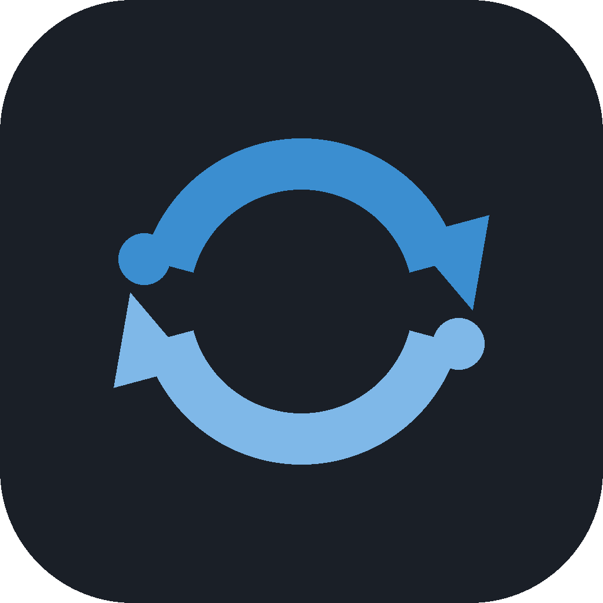

<p align="center"></p>

# local_converter

Jeden lokalny toolkit zamiast szukania "convert X to Y online" za każdym
razem. Wszystko działa offline, bez wgrywania plików na obcy serwer, bez
reklam, limitów rozmiaru czy znaków wodnych.

## Gotowa paczka (Windows, bez instalowania Pythona)

Zero Pythona, zero bibliotek do instalowania - pobierz z [Releases](../../releases)
jedną z dwóch wersji:

- **`local_converter-setup.exe`** (zalecane) - zwykły instalator: Dalej, Dalej,
  Zainstaluj. Dodaje wpis w Menu Start, opcjonalny skrót na Pulpicie (zaznacz
  checkbox w trakcie instalacji) i odinstalowywanie przez "Aplikacje i funkcje" -
  jak każdy normalny program.
- **`local_converter-windows.zip`** (wersja przenośna) - bez instalowania:
  rozpakuj folder i uruchom `local_converter.exe` stamtąd (np. na pendrive, albo
  jeśli nie chcesz niczego "instalować" w systemie). W tym samym folderze jest
  **"Utworz skrot na Pulpicie.bat"** - kliknij go raz, żeby dostać skrót na
  Pulpicie zamiast wchodzić za każdym razem do rozpakowanego folderu.

Obie wersje mają dołączone ffmpeg/ffprobe, więc konwersje audio/wideo i
pobieranie z linków działają od razu. Czego NIE zawierają (bo są zbyt
duże/ciężkie, żeby sensownie je dołączyć) - te funkcje działają dopiero po
doinstalowaniu odpowiedniego programu osobno (patrz sekcja Instalacja niżej):
podgląd/odtwarzanie w zakładce Trim (VLC), DOCX → PDF (LibreOffice), OCR
skanów PDF (Tesseract + Poppler). Reszta toolkita działa od razu.

Chcesz zbudować paczkę samodzielnie (np. po własnych zmianach w kodzie)?

```bash
pip install -r requirements.txt pyinstaller
python build_release.py
```

Wynik: `dist/local_converter/` (folder gotowy do uruchomienia) i
`local_converter-windows.zip` (ten sam folder spakowany do rozdania dalej).

Instalator wymaga dodatkowo [Inno Setup 6](https://jrsoftware.org/isinfo.php)
(`winget install JRSoftware.InnoSetup`) i musi być budowany PO `build_release.py`
(korzysta z jego wyniku w `dist/`):

```bash
& "$env:LOCALAPPDATA\Programs\Inno Setup 6\ISCC.exe" assets\installer.iss
```

Wynik: `dist_installer/local_converter-setup.exe`.

## CLI

```bash
python convert.py convert zdjecie.jpg zdjecie.png
python convert.py convert piosenka.mp3 piosenka.wav
python convert.py convert film.mp4 dzwiek.mp3
python convert.py convert raport.docx raport.pdf
python convert.py convert dane.csv dane.json
```

## GUI

Poza linią komend jest też okienkowy interfejs (`gui.py`, oparty o customtkinter)
z tymi samymi operacjami co CLI, przełącznikiem kategorii po lewej i podglądem
postępu/logiem na dole okna:

```bash
pip install -r requirements.txt
python gui.py
```

Interfejs jest dwujęzyczny - przełącznik **PL/EN** na górze panelu bocznego
zmienia język całego okna od razu, bez zamykania i ponownego uruchamiania
programu (trwające pobieranie/konwersja w tle nie są przerywane).

Zakładka **Audio / Wideo → Wideo → MP3** wyciąga samą ścieżkę dźwiękową jako
MP3 z dowolnego pliku wideo/audio, opcjonalnie tylko z wybranego fragmentu
(pola Początek/Koniec można zostawić puste, żeby wziąć cały plik) - szybszy
sposób niż osobno konwertować i przycinać, kiedy zależy Ci tylko na dźwięku.

Zakładka **Audio / Wideo → Przytnij (Trim)** pozwala wskazać plik MP3/MP4 (i inne
formaty audio/wideo). Program automatycznie odczytuje długość pliku (ffprobe) i
rysuje przebieg fali dźwiękowej (jak w DaVinci Resolve i podobnych programach) -
przeciągnij lewy/prawy uchwyt, żeby ustawić start/koniec, albo całe zaznaczenie,
żeby przesunąć zakres bez zmiany jego długości. Pola "Początek"/"Koniec" (HH:MM:SS)
i wizualne zaznaczenie są zsynchronizowane w obie strony - można też po prostu
wpisać czas ręcznie.

Jest też pełny podgląd z odtwarzaniem (silnik VLC - wymaga zainstalowanego VLC
Media Playera, patrz sekcja Instalacja): przycisk Odtwórz/Pauza, Stop i suwak
pozycji, który przesuwa się na żywo podczas odtwarzania (i pozwala przewijać).
Dla plików wideo pod polem pliku wejściowego pokazuje się też podgląd obrazu.

Jeśli plik ma więcej niż jedną ścieżkę audio (np. nagranie z gry, mikrofonu i
Discorda osobno - typowe przy nagrywaniu przez SteelSeries/OBS), pod przebiegiem
fali pojawia się **mikser ścieżek**: każda ścieżka ma własny miniaturowy przebieg
fali, suwak głośności (0-200%) i przycisk Wycisz. Zmiana suwaka/wyciszenia
przelicza podgląd w tle (ok. 1-2s zwłoki) i odtwarzacz gra już zmiksowaną wersję.
Przy wycinaniu fragmentu, jeśli mikser był dotknięty, dźwięk w wyniku jest
zapisywany z tym samym miksem (wymaga to przekodowania audio, więc trwa dłużej
niż zwykłe, błyskawiczne cięcie).

Każde pole pliku wejściowego (i listy wielu plików w Merge PDF / Obrazy→PDF /
Pack) obsługuje też przeciąganie plików z Eksploratora - nie trzeba klikać
"Przeglądaj...", wystarczy upuścić plik na odpowiednie pole.

Zakładka **Pobierz z linku** ściąga film z URL-a (YouTube, Facebook i inne serwisy
wspierane przez yt-dlp) na dysk - wklej link, kliknij "Sprawdź" (pokaże tytuł
i długość oraz sam podpowie nazwę pliku wyjściowego), wybierz jakość (albo samo
audio jako MP3) i "Pobierz". Część filmów z Facebooka wymaga bycia zalogowanym -
zaznacz "Użyj ciasteczek z przeglądarki" i wybierz, z której (Chrome/Edge/Firefox/...),
żeby yt-dlp użyło Twojej aktywnej sesji zamiast pytać o hasło. **Uwaga:** pobieranie
z tych serwisów łamie ich regulaminy nawet do użytku prywatnego - to Twoja decyzja,
czy i co pobierasz.(aktualnie filmiki z yt mogą być pobieranie z maksymalną rozdzielczością 360p) 

Jeśli w polu "Plik wyjściowy" wpiszesz samą nazwę (bez folderu), program zapisze
wynik w ostatnio używanym folderze, a jeśli żadnego jeszcze nie było - na Pulpicie.
Ostatnio użyty folder jest zapamiętywany trwale (w `%APPDATA%\local_converter\settings.json`
na Windows), więc zostaje zapamiętany także po zamknięciu i ponownym uruchomieniu
programu - osobno dla każdego komputera, na którym go uruchomisz.

## Instalacja

### 1. Zależności Python

```bash
pip install -r requirements.txt
```

### 2. Programy systemowe (darmowe, ale trzeba doinstalować osobno)

Nie wszystko da się zrobić w czystym Pythonie - audio/wideo i część operacji
na dokumentach korzystają z zewnętrznych, otwartoźródłowych programów.
Toolkit sam Ci powie w komunikacie błędu, czego brakuje, jeśli spróbujesz
użyć funkcji bez zainstalowanego narzędzia.

| Program | Do czego | Windows | macOS | Linux (Debian/Ubuntu) |
|---|---|---|---|---|
| **ffmpeg** | audio, wideo, GIF | `winget install ffmpeg` lub [ffmpeg.org](https://ffmpeg.org/download.html) | `brew install ffmpeg` | `sudo apt install ffmpeg` |
| **VLC Media Player** | podgląd/odtwarzanie w zakładce Trim (GUI) | `winget install VideoLAN.VLC` lub [videolan.org](https://www.videolan.org/vlc/) | `brew install --cask vlc` | `sudo apt install vlc` |
| **LibreOffice** | DOCX → PDF | [libreoffice.org](https://www.libreoffice.org/download/) | `brew install --cask libreoffice` | `sudo apt install libreoffice` |
| **Tesseract OCR** | OCR skanów PDF | [instrukcja](https://github.com/UB-Mannheim/tesseract/wiki) | `brew install tesseract` | `sudo apt install tesseract-ocr` |
| **Poppler** | OCR skanów PDF (renderowanie stron) | [instrukcja](https://github.com/oschwartz10612/poppler-windows) | `brew install poppler` | `sudo apt install poppler-utils` |

`yt-dlp` (pobieranie z linku) jest zwykłą zależnością Python w `requirements.txt` -
nie trzeba nic doinstalowywać systemowo poza samym ffmpeg (już w tabeli wyżej),
którego yt-dlp używa do złączenia wideo+audio i wyciągania MP3.

Jeśli nie potrzebujesz OCR, DOCX→PDF czy podglądu/odtwarzania w GUI, możesz pominąć
odpowiednio LibreOffice/Tesseract/Poppler/VLC - reszta toolkita (obrazy, audio/wideo,
PDF, dane, archiwa) działa bez nich poza samym ffmpeg dla audio/wideo. Bez VLC
zakładka Trim nadal działa (przycinanie po wpisanych czasach), tylko bez podglądu -
GUI wypisze o tym informację w logu zamiast się wywalić.

## Co jest obsługiwane

### 🖼️ Obrazy (Pillow, bez zewnętrznych programów)
- Konwersja: JPG, PNG, WEBP, BMP, GIF, TIFF, ICO - dowolna para
- `resize` - zmiana rozmiaru z zachowaniem proporcji
- `strip-exif` - usuwa metadane (GPS, model telefonu) przed wysłaniem zdjęcia

### 🎵🎬 Audio i wideo (wymaga ffmpeg)
- Konwersja: MP3, WAV, FLAC, OGG, M4A, AAC, MP4, AVI, MOV, WEBM, MKV
- Wideo → audio działa tą samą komendą `convert` (wyciąga ścieżkę dźwiękową)
- `trim` - wycina fragment
- `to-gif` - wideo → animowany GIF
- `normalize-audio` - wyrównuje głośność
- `compress-video` - zmniejsza rozmiar pliku

### 📄 Dokumenty (PDF/DOCX)
- `img-to-pdf` - obraz(y) → PDF (bez zewnętrznych programów)
- `merge-pdf` / `split-pdf` / `rotate-pdf` (bez zewnętrznych programów)
- `convert plik.pdf plik.docx` - wymaga tylko `pip install pdf2docx`, najlepiej
  działa na PDF-ach tekstowych (nie skanach)
- `convert plik.docx plik.pdf` - wymaga LibreOffice
- `ocr-pdf` - wyciąga tekst ze skanu, wymaga Tesseract + Poppler

### 📊 Dane (bez zewnętrznych programów)
- CSV ↔ JSON, CSV ↔ XLSX, JSON ↔ YAML
- Brak bezpośredniej pary (np. XLSX → YAML)? Przejdź przez JSON jako format pośredni:
  `xlsx → csv → json → yaml`

### 🗜️ Archiwa (bez zewnętrznych programów)
- `pack` / `unpack` - ZIP i TAR.GZ, pliki i całe foldery

### ⬇️ Pobieranie z linku (wymaga pakietu yt-dlp + ffmpeg)
- `download` - YouTube, Facebook i inne serwisy wspierane przez yt-dlp
- Wybór jakości (Najlepsza/1080p/720p/480p) albo tylko dźwięk (MP3)
- Opcjonalne ciasteczka z przeglądarki (Chrome/Edge/Firefox/Brave/Opera) - część
  filmów (np. prywatnych na Facebooku) wymaga zalogowanej sesji
- Zawsze pojedynczy film spod danego linku, nawet jeśli prowadzi do playlisty
- **Pobieranie z tych serwisów łamie ich regulaminy nawet do użytku prywatnego -
  to Twoja decyzja i odpowiedzialność, czy i co pobierasz.**
- Jeśli pobieranie zacznie zwracać `HTTP 403: Forbidden` (YouTube regularnie
  zmienia zabezpieczenia przeciw pobieraniu) - najpierw spróbuj
  `pip install -U yt-dlp`, żeby dostać najnowsze obejścia.

## Pełna lista komend

```bash
python convert.py convert <in> <out> [--quality 90]
python convert.py resize <in> <out> [--width W] [--height H]
python convert.py strip-exif <in> <out>
python convert.py trim <in> <out> --start 00:00:10 --end 00:00:30
python convert.py to-gif <in> <out> [--fps 10] [--width 480]
python convert.py normalize-audio <in> <out>
python convert.py compress-video <in> <out> [--crf 28]
python convert.py merge-pdf <out.pdf> <in1.pdf> <in2.pdf> ...
python convert.py split-pdf <in.pdf> <output_dir>
python convert.py rotate-pdf <in> <out> [--degrees 90]
python convert.py img-to-pdf <out.pdf> <img1> <img2> ...
python convert.py ocr-pdf <in.pdf> <out.txt> [--lang pol+eng]
python convert.py pack <out.zip|out.tar.gz> <plik1> <plik2> ...
python convert.py unpack <in.zip|in.tar.gz> <output_dir>
python convert.py download <url> <out> [--quality "Najlepsza jakość"] [--cookies-browser chrome]
```

Każda komenda ma też `-h`, np. `python convert.py trim -h`.

## Rozszerzanie

Każda kategoria to osobny moduł w `converters/` (images.py, media.py,
documents.py, data.py, archives.py) z prostymi funkcjami `(input, output, ...)`.
Żeby dodać nowy format czy operację, dopisz funkcję w odpowiednim module i
podłącz ją w `convert.py` (albo w `cmd_convert`, albo jako nową podkomendę
w `build_parser()`).

## Licencja

[PolyForm Noncommercial 1.0.0](LICENSE) - w skrócie: używaj, kopiuj, modyfikuj
i udostępniaj dalej za darmo do dowolnego celu niekomercyjnego (użytek osobisty,
nauka, hobby). Wykorzystanie komercyjne (sprzedaż, rebranding, wbudowanie
w płatny produkt/usługę) wymaga osobnej zgody - napisz, jeśli o to chodzi.
